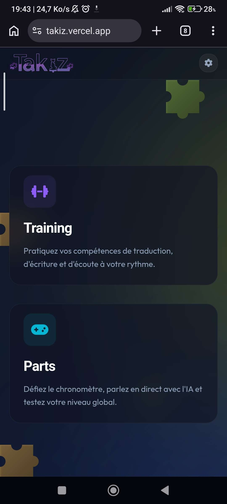
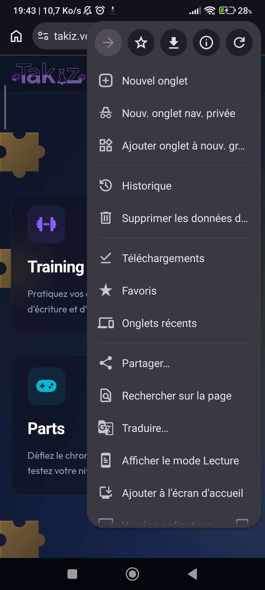
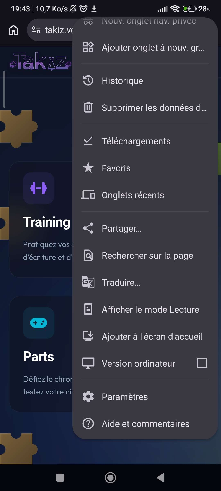
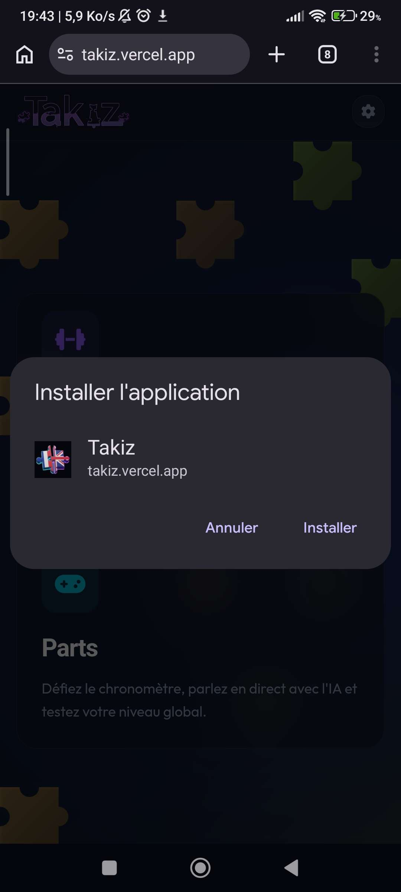

# Takiz

**Takiz** est une application interactive et ludique conçue pour vous aider à pratiquer l'anglais de manière dynamique. À travers différents mini-jeux (Entrainements, Parties, Storm, Dictée, etc.), l'application vous met au défi de traduire, écrire et écouter des phrases à votre rythme ou contre la montre, tout en dialoguant directement avec une Intelligence Artificielle pour vous corriger. C'est l'outil idéal pour tester et améliorer votre niveau global en anglais tout en vous amusant !

## Installation sur PC

1. Rendez-vous dans les **Releases** de ce dépôt GitHub (sur la droite de la page).
2. Téléchargez le dernier fichier **`Takiz Setup.exe`** (ou `Takiz-1.0.0 Setup.exe`).
3. Lancez le fichier `.exe` téléchargé pour installer et ouvrir le jeu. 

## Installation sur Téléphone

1. Ouvrez **Google Chrome** (ou Safari sur iOS) sur votre téléphone.
2. Allez sur le lien officiel de l'application : [https://takiz.vercel.app](https://takiz.vercel.app)

3. Ouvrez le menu de votre navigateur (les **3 petits points `⋮`** en haut à droite sur Chrome, ou le bouton de partage central sur Safari).

4. Faites défiler le menu vers le bas jusqu'à trouver et cliquer sur **"Ajouter à l'écran d'accueil"** (ou "Installer l'application").

5. Validez l'installation. 

Une belle icône Takiz apparaîtra au milieu de vos autres applications !

---